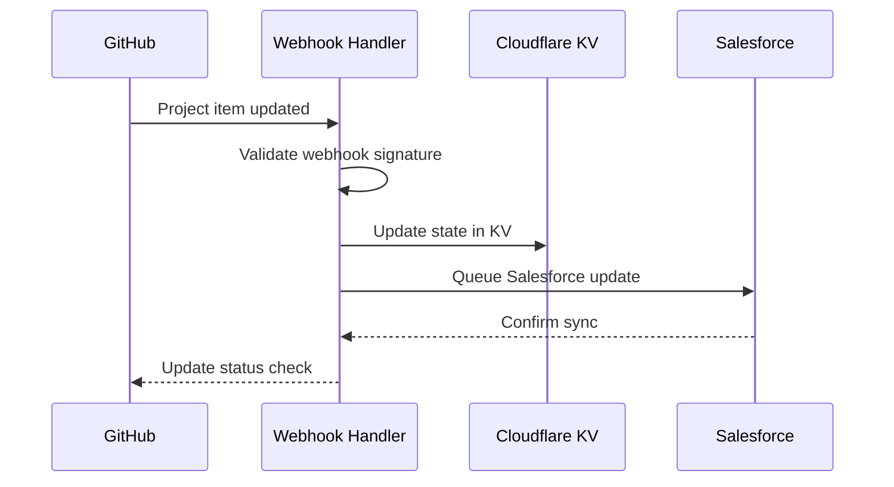

# CRM-Style Project State Management

## Overview

BlackRoad OS uses a CRM (Customer Relationship Management) inspired approach to manage project state across GitHub, Cloudflare, and Salesforce. This creates a unified view of all work while keeping files in Git and state/details in the CRM layer.

---

## Architecture

```
┌─────────────────────────────────────────────────────────────┐
│                    GitHub (Source of Truth)                  │
│  - Code/Files                                                │
│  - Issues/PRs                                                │
│  - Projects v2 (Kanban)                                      │
└─────────────────┬───────────────────────────────────────────┘
                  │
                  ▼
┌─────────────────────────────────────────────────────────────┐
│                   State Sync Layer (NATS)                    │
│  - Real-time event distribution                              │
│  - Bi-directional sync                                       │
│  - Conflict resolution                                       │
└─────────────────┬───────────────┬───────────────────────────┘
                  │               │
                  ▼               ▼
┌─────────────────────┐   ┌─────────────────────────────────┐
│   Cloudflare KV     │   │      Salesforce CRM             │
│  - Fast state cache │   │  - Relationship tracking        │
│  - Session data     │   │  - Opportunity pipeline         │
│  - Agent memory     │   │  - Business intelligence        │
└─────────────────────┘   └─────────────────────────────────┘
```

---

## State Model

### Project States (Salesforce Pipeline Style)

| Stage | GitHub Status | CRM Stage | Description |
|-------|---------------|-----------|-------------|
| 1 | Backlog | Lead | New work identified |
| 2 | Ready | Qualified | Scoped and ready to start |
| 3 | In Progress | Proposal | Active development |
| 4 | In Review | Negotiation | PR open, awaiting review |
| 5 | Done | Closed Won | Merged and deployed |
| 6 | Archived | Closed Lost | Cancelled or abandoned |

### State Object Schema

```json
{
  "id": "item-123",
  "github": {
    "repo": "BlackRoad-OS/blackroad-hello",
    "issue_number": 42,
    "pr_number": null,
    "project_id": "PVT_xxx",
    "status": "In Progress"
  },
  "crm": {
    "stage": "Proposal",
    "probability": 50,
    "owner": "alice-agent",
    "last_activity": "2026-01-27T12:00:00Z"
  },
  "metadata": {
    "created": "2026-01-20T10:00:00Z",
    "updated": "2026-01-27T12:00:00Z",
    "sha_hash": "abc123...",
    "version": 5
  },
  "relationships": {
    "depends_on": ["item-100", "item-101"],
    "blocks": ["item-200"],
    "related_to": ["item-150"]
  }
}
```

---

## Cloudflare KV State Store

### Namespace Structure

```
BLACKROAD_PROJECTS_STATE/
├── projects/
│   └── {project_id}/
│       ├── metadata          # Project metadata
│       ├── items/            # Project items by ID
│       └── views/            # Cached view data
├── repos/
│   └── {owner}/{repo}/
│       ├── status            # Traffic light status
│       ├── config            # Repo configuration
│       └── metrics           # Performance metrics
├── agents/
│   └── {agent_id}/
│       ├── state             # Current agent state
│       ├── memory            # Context memory
│       └── tasks             # Assigned tasks
└── sync/
    ├── last_sync             # Last sync timestamp
    ├── pending               # Pending sync operations
    └── conflicts             # Unresolved conflicts
```

### KV Operations

```javascript
// Write state
await KV.put(`projects/${projectId}/items/${itemId}`, JSON.stringify(state));

// Read state
const state = JSON.parse(await KV.get(`projects/${projectId}/items/${itemId}`));

// Atomic update with version check
const current = await KV.getWithMetadata(key);
if (current.metadata.version === expectedVersion) {
  await KV.put(key, newValue, { metadata: { version: expectedVersion + 1 } });
}
```

---

## Salesforce Integration

### Object Mapping

| GitHub Entity | Salesforce Object | Key Fields |
|---------------|-------------------|------------|
| Organization | Account | Name, Website, GitHub_Org_URL |
| Repository | GitHub_Repository__c | Name, URL, Status, Stars |
| Issue | Task | Subject, Status, Priority |
| PR | GitHub_Pull_Request__c | Number, Title, Status, SHA |
| User | Contact | Name, Email, GitHub_Username |
| Project Item | Opportunity | Name, Stage, Close Date |

### Sync Configuration

```json
{
  "sync_direction": "bidirectional",
  "conflict_resolution": "salesforce_wins_for_business_fields",
  "field_mapping": {
    "github_status": {
      "Backlog": "Prospecting",
      "Ready": "Qualification",
      "In Progress": "Needs Analysis",
      "In Review": "Proposal/Price Quote",
      "Done": "Closed Won",
      "Archived": "Closed Lost"
    }
  },
  "sync_frequency": "real_time",
  "batch_size": 200
}
```

### Salesforce Triggers

```apex
// Trigger on Opportunity update to sync back to GitHub
trigger OpportunitySyncTrigger on Opportunity (after update) {
    for (Opportunity opp : Trigger.new) {
        if (opp.GitHub_Issue_URL__c != null) {
            // Queue sync job to update GitHub Projects
            GitHubSyncService.queueUpdate(opp);
        }
    }
}
```

---

## Event-Driven State Updates

### NATS Subjects

```
blackroad.projects.created     # New project created
blackroad.projects.updated     # Project updated
blackroad.projects.deleted     # Project deleted

blackroad.items.created        # Item added to project
blackroad.items.moved          # Item status changed
blackroad.items.assigned       # Item assigned
blackroad.items.completed      # Item completed

blackroad.sync.github          # GitHub webhook event
blackroad.sync.salesforce      # Salesforce webhook event
blackroad.sync.conflict        # Sync conflict detected
```

### Event Payload

```json
{
  "event_type": "items.moved",
  "timestamp": "2026-01-27T12:00:00Z",
  "source": "github",
  "payload": {
    "item_id": "item-123",
    "from_status": "In Progress",
    "to_status": "In Review",
    "actor": "alice-agent"
  },
  "hash": "sha256_of_payload"
}
```

---

## State Sync Workflow

### GitHub → Cloudflare → Salesforce



### Conflict Resolution

1. **Last Write Wins** (default for non-critical fields)
2. **Source Priority** (GitHub for code, Salesforce for business)
3. **Manual Resolution** (for complex conflicts)

```javascript
async function resolveConflict(githubState, salesforceState) {
  // Code-related fields: GitHub wins
  const codeFields = ['status', 'assignee', 'labels'];

  // Business fields: Salesforce wins
  const businessFields = ['probability', 'amount', 'close_date'];

  return {
    ...githubState,
    // Override business fields from Salesforce
    probability: salesforceState.probability,
    amount: salesforceState.amount,
    close_date: salesforceState.close_date,
    // Mark as resolved
    _conflict_resolved: true,
    _resolved_at: new Date().toISOString()
  };
}
```

---

## API Endpoints

### State Management API

```
GET    /api/state/projects/:id           # Get project state
PUT    /api/state/projects/:id           # Update project state
GET    /api/state/items/:id              # Get item state
PUT    /api/state/items/:id              # Update item state
POST   /api/state/sync                   # Trigger full sync
GET    /api/state/sync/status            # Get sync status
POST   /api/state/resolve-conflict       # Resolve conflict
```

### Webhook Endpoints

```
POST   /api/webhooks/github              # GitHub webhook receiver
POST   /api/webhooks/salesforce          # Salesforce webhook receiver
POST   /api/webhooks/cloudflare          # Cloudflare event receiver
```

---

## Monitoring & Observability

### Key Metrics

| Metric | Description | Target |
|--------|-------------|--------|
| sync_latency | Time to sync state | < 1s |
| sync_success_rate | Successful syncs | > 99.9% |
| conflict_rate | Conflicts per hour | < 1 |
| state_freshness | Age of cached state | < 30s |

### Alerts

- Sync latency > 5 seconds
- Sync failure rate > 1%
- Unresolved conflicts > 10
- State drift detected

### Dashboard

```
┌─────────────────────────────────────────────────────────┐
│                    State Sync Dashboard                  │
├─────────────────────────────────────────────────────────┤
│  Sync Status: 🟢 HEALTHY                                │
│                                                         │
│  Last Sync: 2 seconds ago                               │
│  Pending Operations: 0                                  │
│  Conflicts: 0                                           │
│                                                         │
│  ┌──────────────────────────────────────────────────┐  │
│  │  GitHub → KV: ████████████████████░░ 95%         │  │
│  │  KV → SF:     ██████████████████████ 100%        │  │
│  │  SF → KV:     █████████████████████░ 98%         │  │
│  └──────────────────────────────────────────────────┘  │
└─────────────────────────────────────────────────────────┘
```

---

## Implementation Checklist

### Phase 1: Foundation
- [ ] Set up Cloudflare KV namespaces
- [ ] Create GitHub Projects v2 project
- [ ] Configure Salesforce connected app
- [ ] Set up NATS event bus

### Phase 2: Sync Layer
- [ ] Implement GitHub webhook handler
- [ ] Implement Salesforce webhook handler
- [ ] Build KV state manager
- [ ] Create sync orchestrator

### Phase 3: Integration
- [ ] Connect all three systems
- [ ] Implement conflict resolution
- [ ] Add monitoring and alerts
- [ ] Test failover scenarios

### Phase 4: Optimization
- [ ] Add caching layer
- [ ] Optimize batch operations
- [ ] Implement rate limiting
- [ ] Performance tuning

---

*Last Updated: 2026-01-27*
*Version: 1.0.0*
